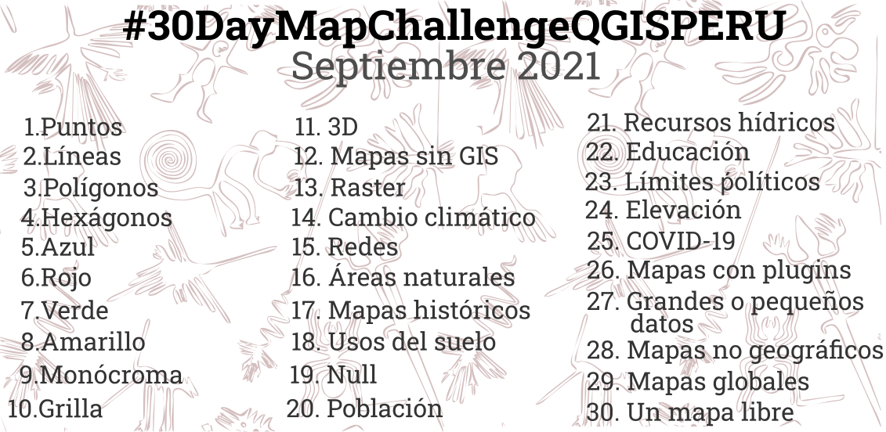

<h1 align="center"><b>#30DayMapChallengeQGISPERU</b> 🇵🇪🌎🗺</h1>
<table>

                  

</table>

_¡Mapatón orientada a compartir mapas temáticos diversos por cada día del mes, empleando software de código de uso libre!_

## __PROYECTO DE MAPEO SOCIAL DIARIO PARA EL MES DE SEPTIEMBRE DEL 2021__ 🚀

¡Hola amigos! Recordemos que el repositorio oficial del #30DayMapChallenge es un desafío diario, iniciado por nuestro amigo **Topi Tjukanov** con el propósito de **mapear/georreferenciar/cartografiar/visualizar/** datos que puedan ser relevantes para la comunidad espacial y para todos en general.

El propósito principal de esta mapatón es la de `crear y publicar` mapas basados en diferentes temáticas** en cada uno de los días del mes en el que se desarrolle. Para ello se utilizará el hashtag #30DayMapChallengeQGISPERU y podremos ver el calendario de temas a continuación. ¡Es todo un reto, ehhh!

Cada participante podrá preparar sus datos y desarrollar un mapa el cual podrá presentar las veces que desee. Sin embargo, la idea es que por cada día se presente un mapa diferente. Solo debes incluir una imagen del mapa, y cuando lo publiques en **Twitter**   colocar los hashtags:

**#30DayMapChallengeQGISPERU**

**#QGISPERU**

**#ComparteYlibérate**

No existen restricciones en el uso de herramientas o plugins específicos o de tecnologías binarias de uso libre (vale decir, si utilizas otros softwares de `CÓDIGO DE USO LIBRE`). Si haces menos de 30, también está bien. **¡La idea es desarrollar!**

Por favor, consulta nuestro código de conducta al final de la página.

## __TEMAS__ 📆

| Día | Fecha | Tema | Detalles |
| ------------- | ------------- | ------------- | ------------- |
| 1	| 	1/09/2020	 | 	Puntos	 | 	Un mapa con puntos.	  |
| 	2	 | 	2/09/2020	 | 	Líneas	 | 	Un mapa con líneas.	  |
| 	3	 | 	3/09/2020	 | 	Polígonos	 | 	Un mapa con polígonos.	  |
| 	4	 | 	4/09/2020	 | 	Hexágonos	 | 	Un mapa con hexágonos.	  |
| 	5	 | 	5/09/2020	 | 	Azul	 | 	Un mapa con la temática del color azul o un mapa donde predomine el azul o derivados.	  |
| 	6	 | 	6/09/2020	 | 	Rojo	 | 	Un mapa con la temática del color rojo o un mapa donde predomine el rojo o derivados.	  |
| 	7	 | 	7/09/2020	 | 	Verde	 | 	Un mapa con la temática del color verde o un mapa donde predomine el verde o derivados.	  |
| 	8	 | 	8/09/2020	 | 	Amarillo	 | 	Un mapa con la temática del color amarillo o un mapa donde predomine el amarillo o derivados.	  |
| 	9	 | 	9/09/2020	 | 	Monócromo	 | 	Una imagen monocromática se compone de un color (o valores de un color). Entonces, por ejemplo, los mapas en blanco y negro son válidos.	  |
| 	10	 | 	10/09/2020	 | 	Grilla	 | 	Ya sea que lo llamemos grilla, grid o red de pescar, el objetivo es visualizar un mapa donde el protagonista sea la grilla y sus usos.	  |
| 	11	 | 	11/09/2020	 | 	3D	 | 	¡Muestra un dato, hecho, información o lo que desees en un mapa en 3D! Existe documentación oficial en QGIS para que tengas referencias.	  |
| 	12	 | 	12/09/2020	 | 	Mapas no realizados con un sofwtare SIG	 | 	¡Muestra tu creatividad sin un SIG!	  |
| 	13	 | 	13/09/2020	 | 	Raster	 | 	Podemos hacer cualquier mapa incluyendo datos raster, sin embargo, ¡este día el protagonista será el pixel!.	  |
| 	14	 | 	14/09/2020	 | 	Cambio Climático	 | 	El cambio climático es un desafío y tenemos un papel importante para comunicarlo espacialmente.	  |
| 	15	 | 	15/09/2020	 | 	Redes	 | 	Redes y conexiones.	  |
| 	16	 | 	16/09/2020	 | 	Áreas naturales	 | 	Las áreas naturales tienden a verse hermosas en los mapas. Más aún si es con software de código de uso libre.	  |
| 	17	 | 	17/09/2020	 | 	Mapas históricos	 | 	Datos históricos, estilo de mapa históricos y algo más.	  |
| 	18	 | 	18/09/2020	 | 	Usos del suelo	 | 	¿Cuáles son los tipos de usos de suelo que se aplican en ciudades, regiones, países o continentes? ¿Cómo ha cambiado en el tiempo?.	  |
| 	19	 | 	19/09/2020	 | 	NULL	 | 	Datos perdidos. Todos odiamos eso, ¿verdad?. Bueno, entonces ¿cómo mapeaamos algo que falta?. ¡Es un reto!.	  |
| 	20	 | 	20/09/2020	 | 	Población	 | 	No todo son gráficos de barras o plots. ¿Te has dado cuenta cómo la tasa poblacional ha venido evolucionando a través del tiempo, espacialmente?	  |
| 	21	 | 	21/09/2020	 | 	Recursos hídricos	 | 	Océanos, lagos, ríos o algo hídrico completamente diferente.	  |
| 	22	 | 	22/09/2020	 | 	Educación	 | 	Ya sean mapas estáticos o dinámicos, existen muchas formas de realizar mapas que eduquen. Muestra tu talento a los alumnos :)	  |
| 	23	 | 	23/09/2020	 | 	Límites políticos	 | 	Los límites están a nuestro alrededor. Algunos de ellos son visibles y otros están en nuestra cabeza, o corazón.	  |
| 	24	 | 	24/09/2020	 | 	Elevación	 | 	Hermosas sombras, bellos contornos, altas montañas o valles bajos. Los mapas de elevación lo dicen todo.	  |
| 	25	 | 	25/09/2020	 | 	COVID-19	 | 	Estamos muy cansados de ver este tema por todos los luagres, pero no podemos omitirlo. Vamos, poco a poco va decreciendo la curva.	  |
| 	26	 | 	26/09/2020	 | 	Mapas realizados con nuevos plugins	 | 	Este día será un **#CaféConPluggins** exclusivo para la mapatón.	  |
| 	27	 | 	27/09/2020	 | 	Grandes o pequeños datos	 | 	¿A qué le llamamos "grandes datos espaciales" significativos? ¿Qué tipo de datos espaciales son "pequeños" pero interesantes?.	  |
| 	28	 | 	28/09/2020	 | 	Mapas no geográficos	 | 	Mapas mentales, mapas de planetas, mapas de bacterias microscópicas o tal vez incluso algo más extraño.	  |
| 	29	 | 	29/09/2020	 | 	Mapas globales	 | 	El mundo no es plano, por lo que con este mapa puedes enfatizar la redondez de nuestro planeta. Puede utilizar, por ejemplo, algunos plugins de QGIS.	  |
| 	30	 | 	30/09/2020	 | 	Un mapa libre	 | 	Sin reglas. Has llegado hasta aquí, así que haz lo que quieras. Solo haz un mapa.	  |

## __DATOS__ 📍📌
Puede utilizar los datos que usted elija. Aquí hay algunas fuentes que podrían ayudarte a comenzar o tener nuevas ideas 💡🧮👇

* [__OpenStreetMap (OSM)__:](https://www.openstreetmap.org/#map=6/-9.301/-75.002)
Es un proyecto colaborativo para crear un gran mapa editable,gratuito, y a nivel mundial. Hay últiples formas de aprovechar la información de OSM, tales como osmdata.xyz for gpk, Overpass API for GeoJSONs, etc.

* [__Natural Earth Data___](https://www.naturalearthdata.com/)
Es un conjunto de datos de mapas de dominio público disponible a escalas 1:10 m, 1:50 my 1: 110 millones. Con datos vectoriales y ráster estrechamente integrados, con Natural Earth puede crear una variedad de mapas visualmente agradables y bien elaborados con cartografía o software GIS.

* [__GEOPERU__:](https://www.geoperu.gob.pe/)
Es una plataforma que permite identificasr brechas sociales, económicas, de infraestrucura, darle seguimiento y ejecución de proyectos, así como el soporte para la planificación y proyección territorial. Desarrollada por el Estado Peruano, utilizando 100% código de uso libre.

* [__ESCALE__:](http://escale.minedu.gob.pe/)
Es un portal web que permite el acceso a datos estadísticos del sector Educación, mediante módulos de consultas, visores de contenidos, mapas y descargas.

* [__Sala Situacional COVID-19 PERÚ__:](https://covid19.minsa.gob.pe/sala_situacional.asp)
Es un tablero de control que muestra los datos actualizados oficiales de los casos positivos, fallecidos, letalidad, pruebas aplicadas, personas hospitalizadas, entre otros, respecto al COVID-19 en el Perú.

## __HERRAMIENTAS__ 🔧⚙
Debido a que el desafío está dirigido a estar abierto para **todos**, las herramientas enumeradas aquí serán herramientas de **código abierto (de uso libre)**. Eso no significa que el desafío se pueda realizar con cualquier tipo de software (o incluso sin ningún software). Las habilidades de programación no son de ninguna manera un requisito para hacer los mapas. 💡🧮👇

* [__QGIS:__ ](https://qgis.org/es/site/)
Es es una aplicación profesional de SIG que está construida sobre, y orgullosa de ser, Software Libre y de Código Abierto (FOSS).

* [__R:__ ](https://www.r-project.org)
Es un lenguaje de programación de análisis estadístico con herramientas gráficas muy avanzadas, y es un referente en el análisis estadístico desde hace muchos años. Existen diversas librerías espaciales para realizar cálculos avanzados espaciales.

* [__gvSIG:__ ](http://www.gvsig.com/es)
Es un proyecto de desarrollo de software para Sistemas de Información Geográfica basado en software libre, utilizando Jython como una implementación de Python realizada en Java.

## __RECURSOS__ 🎨 📑

* [__Symbology-Hub:__ ](https://github.com/qgispe/Symbology-Hub) Simbología variada para la elaboración de mapas temáticos.

* [__Patches:__ ](https://github.com/qgispe/QGIS-Patches-Peru) Patches perzonalizados para Perú y otros.

## __CÓDIGO DE CONDUCTA__ 📜⚖
No importa si eres un experto en SIG o nunca hiciste un mapa, todos son bienvenidos a participar. Sin embargo, ten en cuenta algunas cosas:

- Todos los mapas que publiques deben ser su trabajo original. No robes contenido de otros.
- Dé crédito a la fuente de datos original siempre que sea posible.
- El desafío tiene que ver con la creatividad, la apertura y lo maravilloso que es trabajar con mapas y cartografía. No es una competencia, es diversión :)

## __REFERENCIA__

Inspirados para el challenge en [#30DayMapChallenge](https://github.com/tjukanovt/30DayMapChallenge), [Topi Tjukanov](https://github.com/tjukanovt) y la libertad de compartir y liberarnos.

